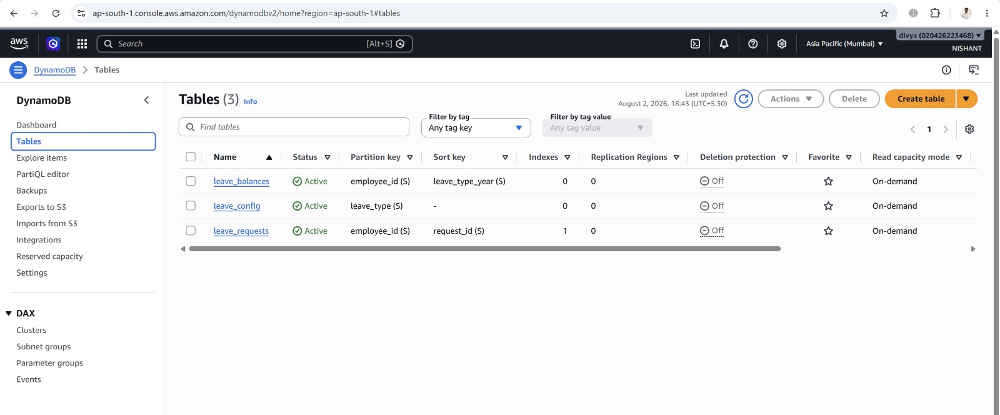
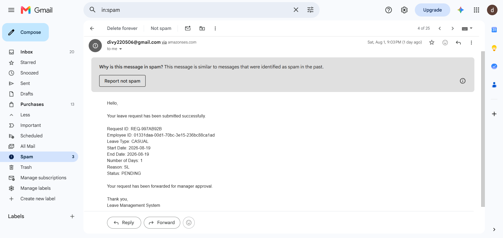
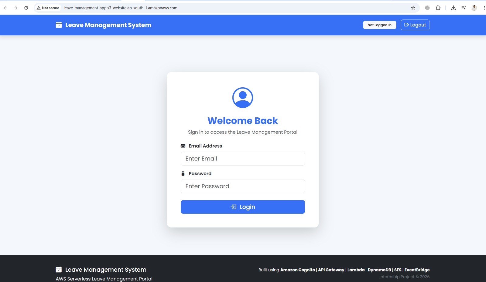

# AWS Leave Management System

A serverless leave management system built on AWS, enabling employees to apply for leave, and managers and HR to review and approve requests — all backed by automated email notifications.

---

## Architecture Overview


The system is fully serverless and event-driven, built with the following AWS services:

| Service | Role |
|---|---|
| **API Gateway** | HTTP API that routes requests to Lambda functions |
| **AWS Lambda** | Business logic for all operations |
| **DynamoDB** | NoSQL database for leave requests, balances, and config |
| **AWS Step Functions** | Orchestrates the multi-step HR approval workflow |
| **Amazon SES** | Sends email notifications to employees |
| **Amazon S3** | Hosts the static frontend |
| **Amazon EventBridge** | Triggers the weekly balance summary job |

---

## How It Works

### Leave Request Flow

1. Employee submits a leave request via the frontend.
2. The system validates the leave balance and checks for date overlaps.
3. The request is stored in DynamoDB with `PENDING` status and the employee receives an email confirmation.
4. The manager reviews the request and takes an action (APPROVE / REJECT).
5. **If the request is ≤ 5 days** and approved by the manager → status set to `APPROVED`, leave balance deducted.
6. **If the request is > 5 days** and approved by the manager → status set to `PENDING_HR` and forwarded to AWS Step Functions, which triggers the HR approval workflow.
7. HR approves or rejects the request. On HR approval, balance is deducted and the employee is notified.
8. Employee receives a final email with the outcome at every stage.

### Weekly Notification

An automated job (triggered via EventBridge on a weekly schedule) emails every employee a summary of their current leave balances — total, used, and remaining — for all leave types.

---

## Project Structure

```
AWS_Leave_Management_System/
├── architecture/
│   └── leave management system architecture diagram.png
├── backend/
│   ├── api_gateway/
│   │   └── leave_management_api.json       # OpenAPI 3.0 API Gateway export
│   ├── lambda/
│   │   ├── submit_leave_request.py         # Employee submits a leave request
│   │   ├── get_leave_balances.py           # Fetch leave balances for an employee
│   │   ├── get_pending_requests.py         # Fetch all PENDING leave requests
│   │   ├── process_manager_action.py       # Manager approves or rejects a request
│   │   ├── hr_approval.py                  # HR approves or rejects escalated requests
│   │   ├── approve_leave_requests.py       # Called by Step Functions to finalize approval
│   │   ├── finalize_leave.py               # Step Functions task to finalize leave status
│   │   └── weekly_balance_maintenance.py   # Weekly email job for balance summaries
│   └── step_functions/
│       └── leave_approval.json             # Step Functions state machine definition
├── database/
│   └── readme.md                           # DynamoDB table schemas
├── docs/
│   └── Document (1).pdf
├── frontend/
└── screenshots/
    ├── Dynamo_db_tables.jpeg
    ├── email_confirmation.png
    └── website_login_page.jpeg
```

---

## API Endpoints

Base URL: `https://wctaatws13.execute-api.ap-south-1.amazonaws.com`

| Method | Path | Description | Lambda |
|---|---|---|---|
| `POST` | `/leave/apply` | Submit a new leave request | `submit_leave_request` |
| `GET` | `/leave/balance` | Get leave balances for an employee | `get_leave_balances` |
| `GET` | `/leave/pending` | Get all pending leave requests | `get_pending_requests` |
| `POST` | `/leave/action` | Manager approves or rejects a request | `process_manager_action` |

### POST `/leave/apply`

```json
{
  "employee_id": "EMP001",
  "leave_type": "SICK",
  "start_date": "2026-08-15",
  "end_date": "2026-08-17",
  "num_days": 3,
  "employee_email": "employee@example.com",
  "manager_id": "MGR001",
  "reason": "Fever"
}
```

### GET `/leave/balance`

```
GET /leave/balance?employee_id=EMP001
```

### POST `/leave/action`

```json
{
  "employee_id": "EMP001",
  "request_id": "REQ-XXXXXXXX",
  "action": "APPROVE",
  "manager_comments": "Approved"
}
```

> For HR approval, a separate internal endpoint handled by `hr_approval.py` accepts the same shape with an `hr_comments` field instead of `manager_comments`.

---

## Database (DynamoDB)

Three tables, all using on-demand capacity:

### `leave_requests`
Stores all leave requests.
- **PK:** `employee_id` | **SK:** `request_id`
- **GSI:** `manager_id-index` (PK: `manager_id`, SK: `status`) — used to query requests per manager by status

### `leave_balances`
Tracks leave quotas per employee per year.
- **PK:** `employee_id` | **SK:** `leave_type_year` (e.g., `SICK#2026`)

### `leave_config`
Stores global configuration for each leave type (e.g., max days per year).
- **PK:** `leave_type`



---

## Leave Types

| Type | Description |
|---|---|
| `SICK` | Sick leave |
| `CASUAL` | Casual leave |
| `EARNED` | Earned / annual leave |

---

## Step Functions — HR Approval Workflow

When a manager approves a request with more than 5 days, the system starts a Step Functions execution:

1. **Wait** — short delay before processing
2. **HR Required?** — checks if `num_days > 5`
3. **Wait For HR** — holds execution while HR reviews
4. **approve_leave_request** — Lambda task that finalizes the status

State machine definition: [`backend/step_functions/leave_approval.json`](backend/step_functions/leave_approval.json)

---

## Email Notifications (Amazon SES)

Employees receive emails at these stages:

- Leave request submitted (with request ID and details)
- Manager approves or rejects the request
- HR approves or rejects (for escalated requests)
- Weekly balance summary (automated every week)



---

## Frontend

The frontend is a static web application hosted on Amazon S3.

S3 Website URL: `http://leave-management-app.s3-website.ap-south-1.amazonaws.com`



---

## Deployment Notes

- AWS Region: `ap-south-1` (Mumbai)
- SES must have the sender email (`divy220506@gmail.com`) verified before emails can be sent.
- All Lambda functions are deployed individually and connected to API Gateway via AWS proxy integration.
- The Step Functions ARN is hardcoded in `submit_leave_request.py` and `process_manager_action.py` — update these if redeploying to a new account or region.
- The weekly balance job should be wired to an **EventBridge rule** on a `cron` or `rate` schedule targeting `weekly_balance_maintenance`.

---

## Screenshots

| DynamoDB Tables | Email Confirmation | Login Page |
|---|---|---|
|  |  |  |
